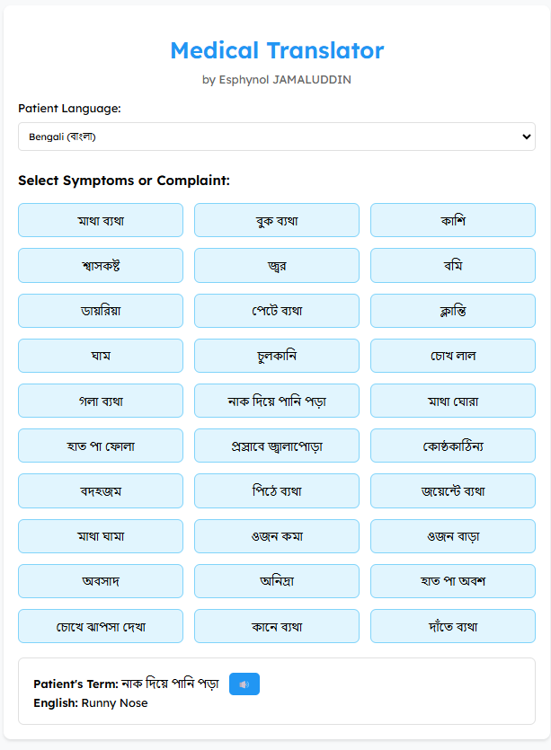

# Medical Translator 🌐

**by Esphynol JAMALUDDIN**

A web app to help non-English speaking patients (Bengali, Myanmar, Nepali) communicate symptoms with doctors in English.

 <!-- Add a screenshot later -->

## Features ✨
- 30+ symptoms translated across 3 languages.
- Speech synthesis for English translations.
- Clean and responsive UI.

## How to Use 🚀
1. Select the patient’s language.
2. Click a symptom to see its English translation.
3. Use the 🔊 button to hear the translation aloud.

## Technologies Used 💻
- HTML, CSS, JavaScript
- Web Speech API

## License 📜
MIT License
